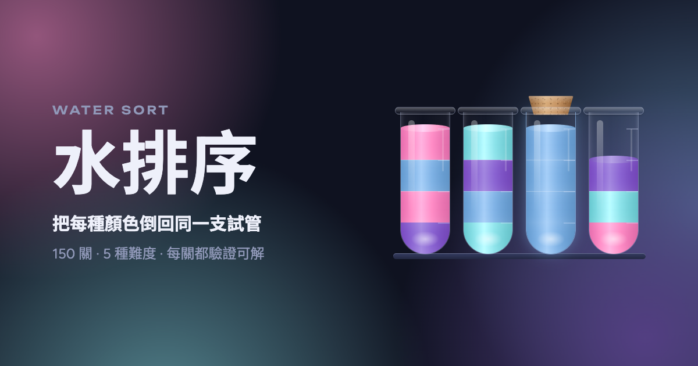
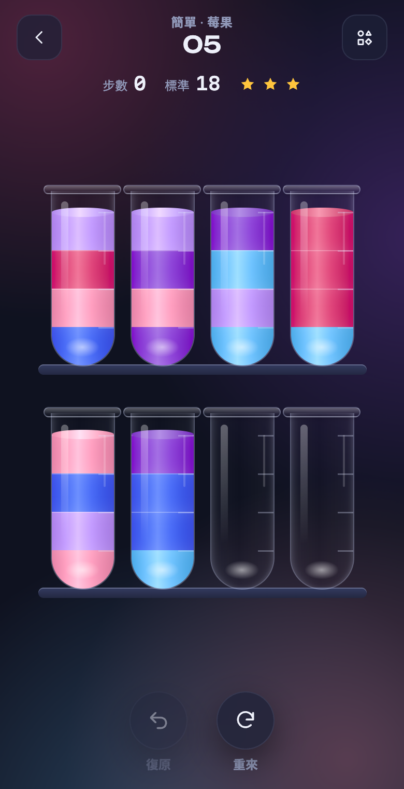

# 水排序 Water Sort

[中文](#中文) · [English](#english)

**▶ 立即遊玩 / Play now: <https://fumitsuki.tw/water-sort/>**



---

## 中文

把每種顏色倒回同一支試管的益智遊戲。直接在瀏覽器裡玩，手機、桌機都可以，不用安裝。



### 玩法

- 點一支試管拿起來，再點另一支試管，把最上面那段顏色倒過去。
- 只能倒進空試管，或倒在相同顏色上面，而且目標要還有空間。
- 每支試管都只裝一種顏色就過關。
- 過關不難，用最少步數拿到三顆星才是挑戰。步數旁的星星會即時顯示你還保得住幾顆。
- 復原和重來不限次數。

### 特色

- **150 關、5 種難度**：入門、簡單、普通、困難、大師，每級 30 關。
- **每一關都保證有解**：每一關都由求解器驗證過，標準步數是搜尋找到的最短解。
- **8 組藥水配色**：棉花糖、美人魚、雪酪、星雲等，每組都經過色差檢查，確保顏色分得清楚。
- **倒水物理**：傾斜角度依剩餘液量計算，液面保持水平、液量守恆。
- **亮色／暗色主題**、**色盲符號模式**、**中英文切換**。
- 進度存在瀏覽器裡（localStorage），不需要帳號。

### 難度是怎麼設計的

難度靠的是「空間緊不緊」，不是盤面大不大。顏色多、空試管多的大盤面只是比較久；只多一支試管的小盤面才需要先規劃好幾步。

每關在產生時都會經過三層篩選：

1. 求解器證明有解。
2. 模擬一個只挑眼前好步、不往後想的「隨手玩家」玩 40 次，用卡關率當難度分數。困難級要求 75% 以上卡關，大師級要求 90% 以上。
3. 依難度分數排序，讓每一級從前到後逐漸變難。

### 開發

純 HTML／CSS／JavaScript，沒有建置流程，也沒有相依套件。

```sh
open index.html                  # 直接開來玩
node tools/engine.js             # 規則與求解器自我檢查
node tools/gen_levels.js         # 重新產生 levels.js（約 5 秒）
node tools/check_palettes.js     # 檢查配色是否分得清楚
node tools/probe.js              # 研究不同盤面配置的難度
```

| 檔案 | 用途 |
|---|---|
| `index.html` | 遊戲本體 |
| `levels.js` | 產生出來的關卡資料（不要手改） |
| `palettes.js` | 藥水配色 |
| `tools/` | 規則引擎、求解器、關卡產生器、配色檢查 |

要調難度，改 `tools/gen_levels.js` 開頭的 `TIERS` 設定再重新產生。

---

## English

A color-sorting puzzle: pour each potion back into a tube of its own. Plays in the browser on phone or desktop, nothing to install.


### How to play

- Tap a tube to pick it up, then tap another to pour its top color across.
- You can pour only into an empty tube or onto the same color, and only if there is room.
- Clear the level when every tube holds a single color.
- Clearing is easy. Three stars means matching par, the shortest solution found. The stars next to your move count show how many you can still earn.
- Undo and restart are unlimited.

### Features

- **150 levels in 5 tiers**: Intro, Easy, Normal, Hard and Master, 30 levels each.
- **Every level is solvable**: each one is checked by a solver, and par comes from a search for the shortest solution.
- **8 potion palettes** (Cotton Candy, Mermaid, Sherbet, Nebula and more), each checked so every color in a level stays distinct.
- **Pour physics**: the tilt follows how much liquid is left, the surface stays level and the volume is conserved.
- **Light and dark themes**, **color-blind symbols** and a **Chinese/English toggle**.
- Progress is saved in your browser (localStorage). No account needed.

### How difficulty works

Difficulty comes from how tight the space is, not from board size. Big boards with many colors and spare tubes just take longer. Small boards with only one spare tube force you to plan several pours ahead.

Each generated level passes three checks:

1. A solver proves it is solvable.
2. A simulated "casual player" (grabs good-looking moves, never looks ahead) plays it 40 times. Its failure rate is the difficulty score. Hard needs at least 75% and Master at least 90%.
3. Levels are sorted by score, so each tier ramps up.

### Development

Plain HTML, CSS and JavaScript. No build step, no dependencies.

```sh
open index.html                  # play locally
node tools/engine.js             # self-check of the rules and solver
node tools/gen_levels.js         # regenerate levels.js (~5 s)
node tools/check_palettes.js     # check palette colors are distinct
node tools/probe.js              # measure difficulty across board configs
```

| File | Purpose |
|---|---|
| `index.html` | The game |
| `levels.js` | Generated level data (do not edit by hand) |
| `palettes.js` | Potion palettes |
| `tools/` | Rules engine, solver, level generator, palette checker |

To retune difficulty, edit `TIERS` at the top of `tools/gen_levels.js` and regenerate.
